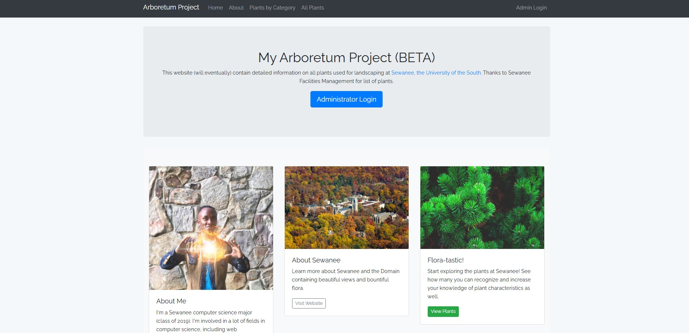



# Sewanee Arboretum Plant Database

## Description

These are files for a website I created with the Laravel framework. It has functionality for viewing, inserting, editing and deleting into a database containing information on plants used for landscaping at Sewanee. I created this to get some experience with the back and front end of web development, as well as working with a web framework. The website is not currently live online, but a demo will be available shortly  on my webiste: [My Website](https://emmanueloluloto.wixsite.com/emmaloto)

## Setup


### 1. Laravel Setup

- Install **PHP** (version 8.x recommended). You can check with `php -v`.
- Install **Composer** (dependency manager for PHP): https://getcomposer.org/
- Install **Node.js** and **npm** (for front-end assets): https://nodejs.org/
	- Check with `node -v` and `npm -v`.

### 2. Database Setup

- Ensure MySQL is installed and running.
- Create a database (e.g., `lsapp`) and a user with privileges:

 ```sql
 CREATE DATABASE lsapp;
 CREATE USER 'plantuser'@'localhost' IDENTIFIED BY '6characters';
 GRANT ALL PRIVILEGES ON lsapp.* TO 'plantuser'@'localhost';
 FLUSH PRIVILEGES;
 ```

- Import the provided SQL file to set up tables and sample data:

 ```sh
 mysql -u plantuser -p lsapp < dbtestsetup.sql
 ```

### 3. .env File Changes

- Copy `.env.example` to `.env` if needed.
- Set the following values in your `.env` file:

 ```env
 DB_CONNECTION=mysql
 DB_HOST=127.0.0.1
 DB_PORT=3306
 DB_DATABASE=lsapp
 DB_USERNAME=plantuser
 DB_PASSWORD=6characters
 ```

### 4. Artisan Commands

- Generate the application key:

 ```sh
 php artisan key:generate
 ```

- Run migrations (if not using the SQL file):

 ```sh
 php artisan migrate
 ```

- (Optional) Seed the database:

 ```sh
 php artisan db:seed
 ```

### 5. Running Laravel

- Start the development server:

 ```sh
 php artisan serve
 ```

- Visit [http://localhost:8000](http://localhost:8000) in your browser.


